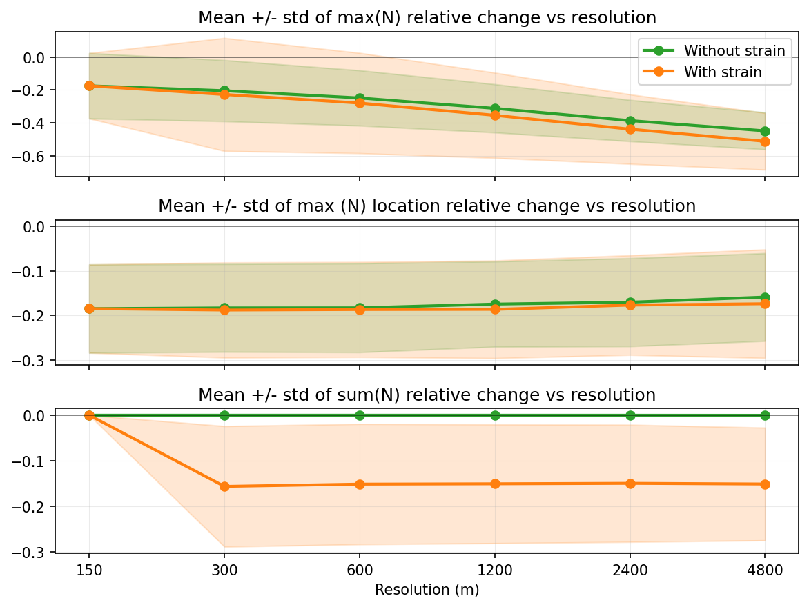

<section>

## Summary of current effects on wave propagation

During the 24-hour propagation of a wave train over a submesoscale front:

  
  

    <ul>
      <li>Grid-resolved current reduced the swell peak by ~20-45% on average.</li>
      <li>Subgrid-scale strain caused an additional ~5% reduction.</li>
      <li>Subgrid-scale strain reduced total action from waves by ~15% on average.
    </ul>
  

  
  

    
  

</section>

<section>

## Takeaways

* Wave propagation is sensitive to strong current gradients: ~20-45% effect on average, depending on the resolution
* Governing equation is (mostly) still valid within the original asymptotic limit
* Subgrid-scale strain term should be considered for inclusion in models when high-resolution currents are available
</section>

<section>

## Thank you!

<a href="mailto:mcurcic@miami.edu">mcurcic@miami.edu</a>
</section>